# Zmind-map

> 基于开源项目 [wanglin2/mind-map](https://github.com/wanglin2/mind-map) 二次开发的 **Windows 桌面 AI 思维导图应用**（幕布快捷键风格 · 本地运行 · 全功能免费）。

[](https://github.com/bubu-LZY/Zmind-map)
[](./mind-map/LICENSE)
[](./UPDATE_LOG.md)

---

## 📌 项目主页（含功能演示动图）

- 国内访问：[腾讯云 CloudStudio 部署](https://3341ba1297ab44a2aabcb13f85f18e9d.bj4.agentos-app.net/#ai-generate)
- GitHub Pages：[https://bubu-lzy.github.io/Zmind-map/](https://bubu-lzy.github.io/Zmind-map/)

主页内置 8 大功能的实拍演示动图，建议先看主页再决定下载。

---

## ✨ 功能特性

| # | 功能 | 说明 |
|---|------|------|
| 1 | **AI 生成思维导图** | 配置 OpenAI 兼容 API 后，一键**生成**子节点、**续写**分支细节；另有「背诵改写」只改文字不增删节点 |
| 2 | **AI 智能挖空** | 整图或选中节点交给 AI 自动挖空，复习提效（保守策略，不破坏结构） |
| 3 | **AI 挖空（手动）** | `Ctrl+Enter` 选区/整节点挖空，`[==文本==]` 大纲语法，节点级显隐 |
| 4 | **艾宾浩斯遗忘曲线** | 9 周期复习计划（5 分钟～31 天），一键添加复习任务、定制复习节奏 |
| 5 | **飞书定时提醒** | 配置飞书 Webhook 后，按遗忘曲线在对应时间点自动推送复习卡片 |
| 6 | **前端端口开放（8080）** | 局域网 / 内网穿透可访，Web 端与桌面端双向实时同步 |
| 7 | **AI 对话** | 右侧对话面板，支持把节点快速投入对话、把文档同步进对话快速询问 |
| 8 | **悬浮引用** | 文档内 `@` 文件 / `#` 节点引用，悬浮窗即时预览对应导图与节点 |
| — | **完全免费** | 无任何付费墙、无账号体系、无远程收集，**所有数据仅存本地** |

---

## 🎬 功能演示

> 以下均为软件真实操作录屏（动图在 GitHub 上自动播放）。带完整布局与排版的演示主页见 👉 [腾讯云 CloudStudio](https://3341ba1297ab44a2aabcb13f85f18e9d.bj4.agentos-app.net) · [GitHub Pages](https://bubu-lzy.github.io/Zmind-map/)

### 1. AI 生成思维导图

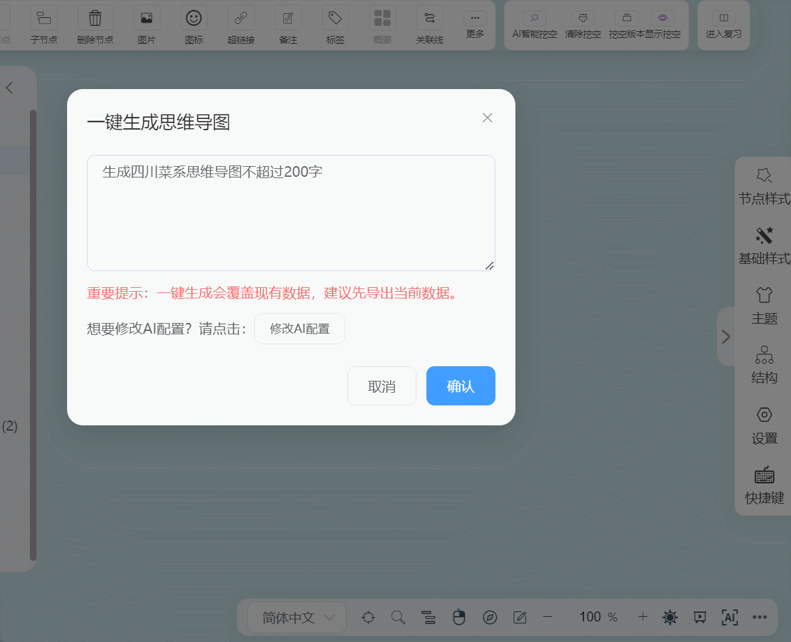

*一键 AI 生成子节点、续写分支细节。*

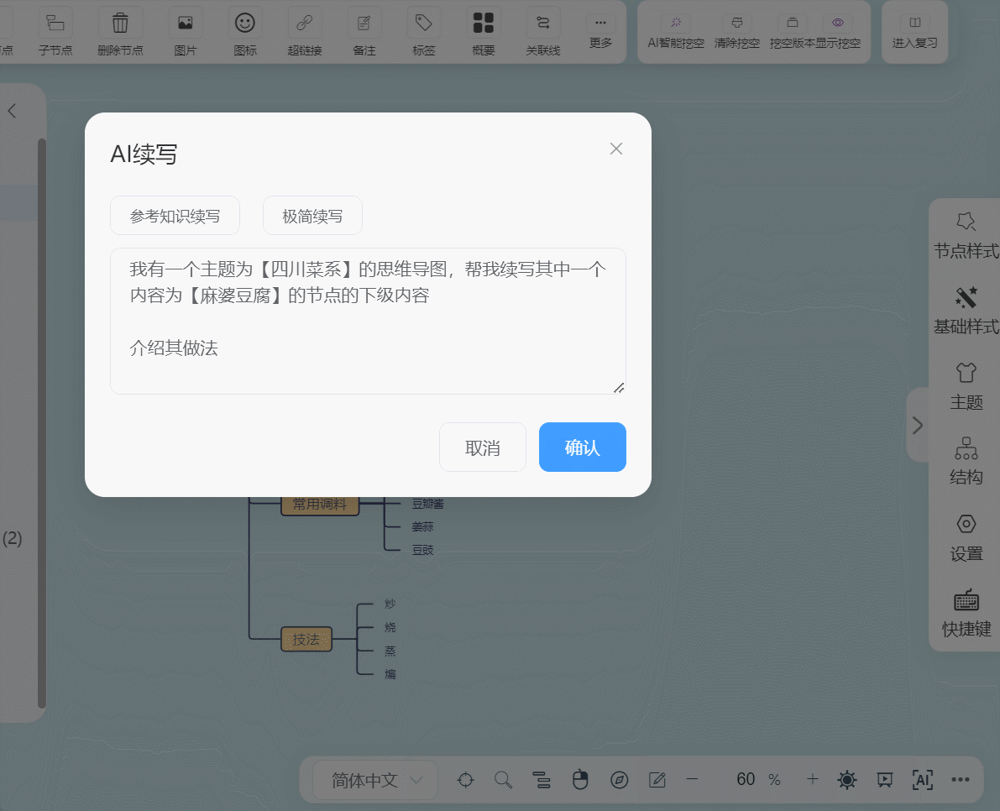

*AI 续写：补充分支细节。*

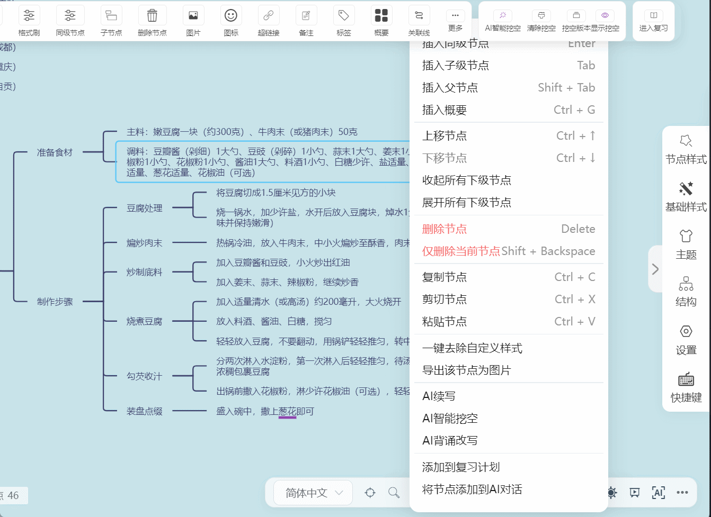

*背诵改写：只改文字、不增删节点。*

### 2. AI 智能挖空

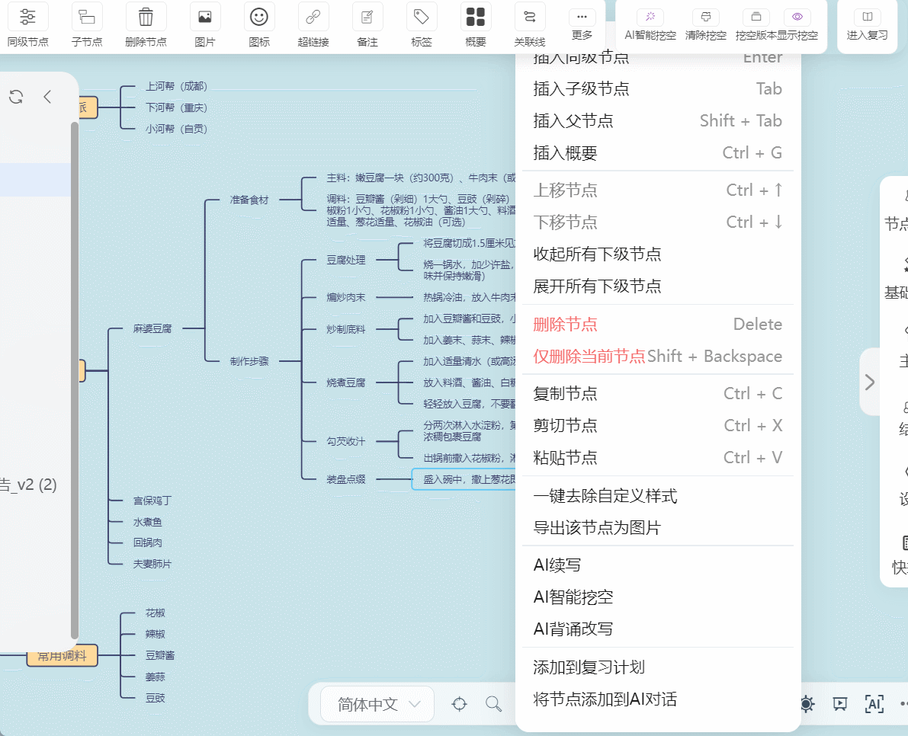

*整图 / 选中节点交给 AI 自动挖空，复习提效（保守策略不破坏结构）。*

### 3. 艾宾浩斯遗忘曲线

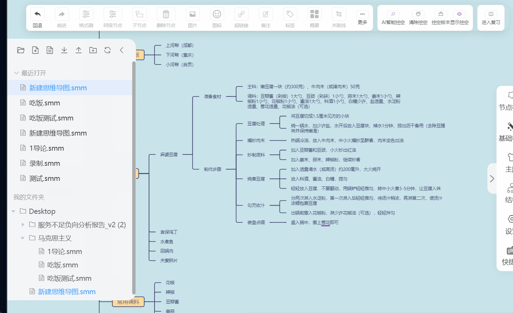

*9 周期复习计划与复习模式。*

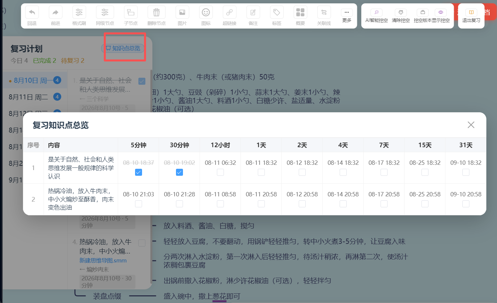

*复习任务总览表。*

### 4. 飞书定时提醒

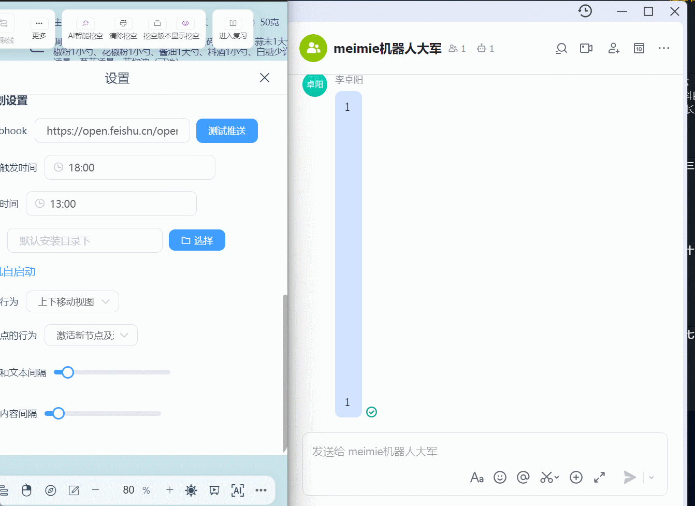

*配置飞书 Webhook 后，按遗忘曲线在对应时间点自动推送复习卡片。*

### 5. 前端端口开放（8080）

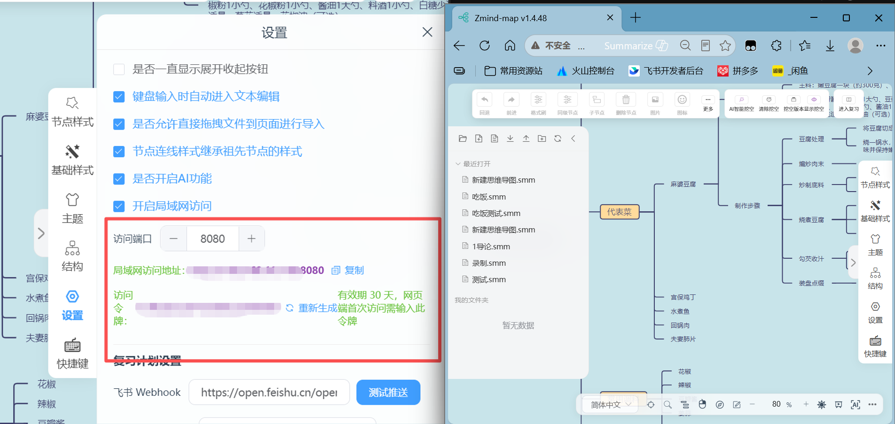

*局域网 / 内网穿透可访，Web 端与桌面端双向实时同步。*

### 6. AI 对话

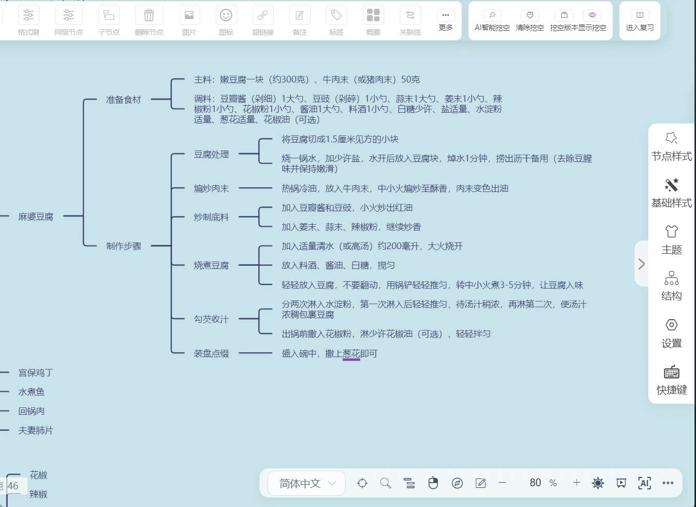

*右侧对话面板：把节点快速投入对话、把文档同步进对话快速询问。*

### 7. 悬浮引用


*`@` 文件引用，悬浮窗即时预览对应导图。*

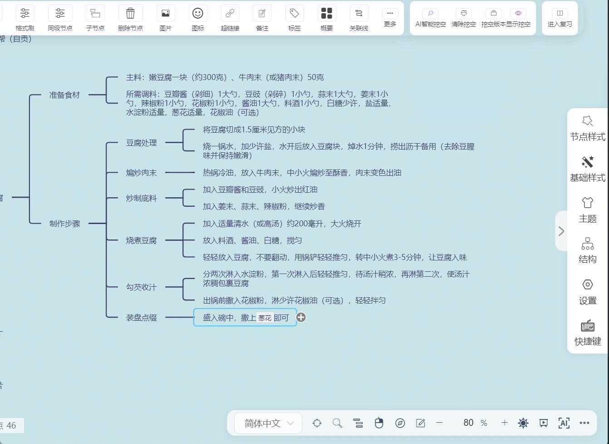

*`#` 节点引用，悬浮窗高亮目标节点。*

---

## 🏗️ 整体架构

Zmind-map 采用 **三层结构**：核心渲染库 → Vue 前端 → Electron 桌面壳，通过 `preload.js` 的 `contextBridge` 桥接 Node 能力。

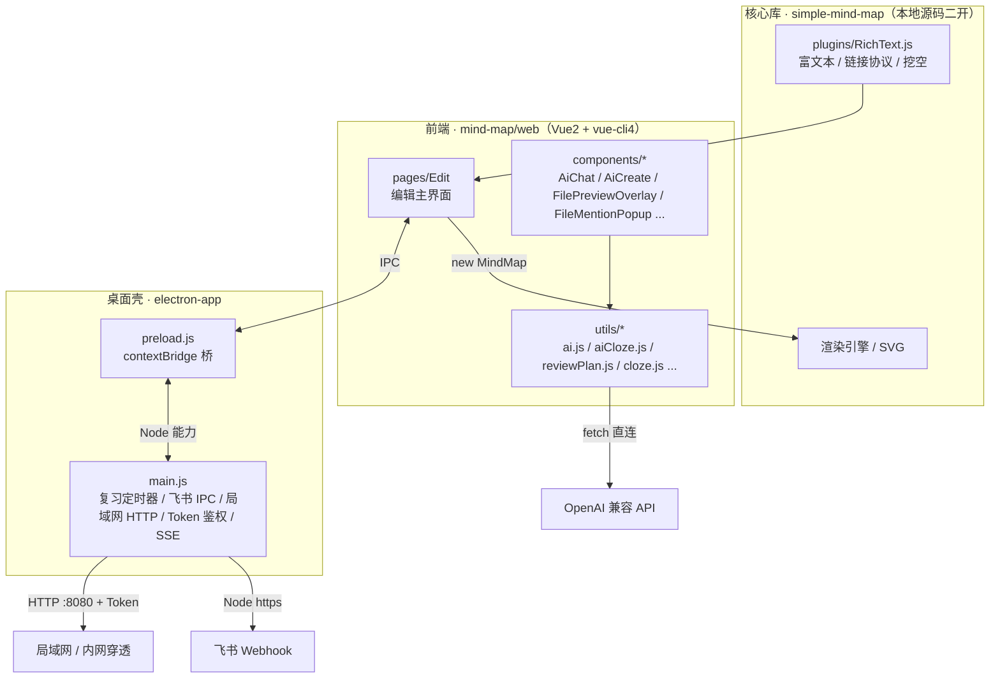

**关键设计取舍**

- **核心库直接改源码**：`simple-mind-map` 不通过 npm 包引入，而是把源码放在 `mind-map/simple-mind-map/`，`vue.config.js` 用 alias 指向本地源码，改即生效。
- **AI 请求走前端**：`utils/ai.js` 用浏览器 `fetch` 直连 OpenAI 兼容接口（DeepSeek / 通义 / Kimi / 火山方舟 / Ollama 等），API Key 仅存本地 `localStorage`，不经过主进程、不上传。
- **局域网由主进程托管**：`main.js` 起一个原生 HTTP 服务（默认 8080），配随机 Token 鉴权，Web 端通过 `EventSource`(SSE) 与 `localStorage` 拦截实现双向实时同步。
- **飞书推送走主进程**：Web 端构造交互卡片 → IPC → `main.js` 用 Node 原生 `https` 发送，避免前端跨域。

---

## ⚙️ 实现方法（要点）

> 完整代码与逐行说明见仓库内 **[`Zmind-map功能实现文档.md`](./Zmind-map功能实现文档.md)**，以下是各功能的实现思路速览。

### 1. 悬浮引用（`@` 文件 / `#` 节点）
- 编辑态输入 `@`/`#` → `RichText` 的 `text-change` 监听触发 `FileMentionPopup` 扫描目录（`*.smm/*.md/*.json`）。
- 选中后插入自定义链接协议：`zmind-file:<绝对路径>` / `zmind-node:<绝对路径>:<节点uid>`。
- **必须覆写 Quill 的 `link.sanitize` 放行上述协议**，否则会被改成 `#` 导致引用失效。
- 渲染态点击 → 主窗口 `position:fixed` 悬浮窗内 `new MindMap({readonly:true})` 渲染被引用导图，蓝框 `DOM div` 高亮目标节点。

### 2. 挖空系统（Cloze）
- 存储载体为 Quill 内建 `code` 格式，保存时 `<code>` → `<span class="smm-cloze">`，加载时还原；大纲用 `[==文本==]` 语法。
- 显示状态（全局显隐 + 按节点覆盖）**不落盘**，靠 `MutationObserver` 在重渲染后重绘，组件卸载时 `destroyCloze()` 防泄漏。
- 禁忌：不要注册自定义 `ClozeBlot`（Quill 2.x 路径冲突会崩）。

### 3. 艾宾浩斯复习（9 周期）
- `reviewPlan.js` 一次性算出 9 个周期（5 分钟、30 分钟、12 小时、1/2/4/7/15/31 天）的复习日期，存 `localStorage(ZMIND_REVIEW_PLAN)`。
- 添加复习任务时把当前文档备份到 `userData/review-backup/`（保证节点 `uid` 一致），点击复习时优先加载备份文件跳转。
- 触发由 `main.js` 每 30s 定时器比对 `HH:MM` + 当日去重 key 控制，启动补推错过的任务。

### 4. AI 能力（通用 OpenAI 兼容）
- `utils/ai.js` 封装流式客户端 `Ai`（`fetch` + SSE 解析 + `AbortController` 停止），统一支撑生成 / 续写 / 智能挖空 / 背诵改写 / 对话。
- 各能力导出 `xxx(config, nodes)` + `stopXxx()`，工具栏按钮带「停止」遮罩；AI 响应先剥离 `<think>` 推理标签再解析 JSON。
- 图片粘贴发送前用 canvas 缩放至最大 1024px + JPEG 0.85 压缩，多模态需额外 `max_tokens`。

### 5. 局域网端口（8080 + Token 鉴权）
- `Setting.vue` 勾选「开启局域网访问」→ `zmindLan.start(8080)` → `main.js` 起 HTTP 服务。
- `LAN_TOKEN_TTL = 30 天`，随机 `crypto.randomBytes(12)` 生成，存 `userData/lan-token.json`；所有 `/api/*` 须带 `?token=` 或 `Authorization: Bearer`，否则 401。
- 端点涵盖 `/api/auth/verify`、`/api/data`、`/api/sync`、`/api/sse`、`/api/fs/*`（增删改查文件）。
- 双向同步：注入脚本拦截 `localStorage.setItem` 防抖回传；`EventSource` 接收推送时设 `_fromSSE` 防回环。

### 6. 飞书定时提醒
- `Setting.vue` 配置 Webhook 地址、`reviewForgotTime`(默认 23:59)、`reviewReminderTime`(默认 20:00)。
- `reviewNotify.js` 构造 `interactive` 卡片，按 `nodeUid` 去重、当日防重复；Web 端 → `window.zmindReview.sendFeishuWebhook` → IPC → `main.js` 用 Node `https` 发送。

---

## 📂 目录结构

```
.
├── mind-map/
│   ├── web/                    # Vue2 + vue-cli4 前端
│   │   ├── src/                # 前端源码（pages/Edit/components/*，utils/*）
│   │   ├── public/             # 静态资源
│   │   ├── vue.config.js       # webpack 配置（alias simple-mind-map$ → 本地源码）
│   │   └── package.json
│   ├── simple-mind-map/        # 核心库源码（二开直接用源码，非 npm 包）
│   │   ├── src/                # 核心源码（plugins/RichText.js 等）
│   │   ├── index.js            # 库入口
│   │   └── package.json
│   ├── index.html              # 原项目 demo 入口
│   ├── LICENSE                 # 原项目 MIT 许可
│   └── README*.md              # 原项目说明
├── electron-app/
│   ├── main.js                 # Electron 主进程（复习定时器、飞书 IPC、局域网 HTTP 服务）
│   ├── preload.js              # 预加载脚本（contextBridge 桥接）
│   ├── package.json            # electron-builder 打包配置
│   ├── app2/                   # 当前版本 web 构建产物（index.html + dist/）
│   └── build/                  # 应用图标
├── docs/                       # GitHub Pages 介绍主页（index.html + images/）
├── Zmind-map功能实现文档.md     # 功能实现文档（复用参考，含代码与逻辑）
└── UPDATE_LOG.md               # 更新日志
```

---

## 🔧 环境要求

- **Node.js** 22.x（推荐 22.22.2）
- **Python 3.x**（仅打包脚本用，可选）
- Windows 操作系统（Electron 桌面端）

---

## 📥 安装与构建

### 1. 安装依赖

```bash
# 前端依赖
cd mind-map/web
npm install

# 核心库依赖（二开直接用源码，无需单独安装 simple-mind-map npm 包）
cd ../simple-mind-map
npm install

# Electron 依赖
cd ../../electron-app
npm install
```

### 2. 构建前端

```bash
cd mind-map/web
# 通过 ZMIND_OUTDIR 指定输出目录，避免 vue-cli 清理旧 dist 触发 safe-delete 问题
ZMIND_OUTDIR="$LOCALAPPDATA/Temp/zmind-build" NODE_OPTIONS=--openssl-legacy-provider node_modules/@vue/cli-service/bin/vue-cli-service.js build
```

### 3. 同步产物到 electron-app/app2

```bash
cp -rf $TEMP/{css,js,fonts,img,logo.ico} electron-app/app2/dist/
cp -f $TEMP/index.html electron-app/app2/index.html
```

### 4. 打包 Electron 安装包

```bash
cd electron-app
env -u ELECTRON_RUN_AS_NODE node_modules/electron-builder/out/cli/cli.js --win --x64
```

产物默认输出到 `release2/`。

---

## 🚀 使用指南

### AI 功能
1. 打开 AI 配置弹窗，填写 **接口地址 / API Key / 模型**（OpenAI 兼容即可）。
2. 点击「连接测试」验证，保存后即可使用生成、续写、智能挖空、背诵改写、AI 对话。
3. API Key 仅保存在本地 `localStorage`，**不上传、不收集**。

### 局域网访问
- 设置中勾选「开启局域网访问」，复制 `http://<局域网IP>:8080?token=xxx` 在手机/其他设备浏览器打开。
- 支持内网穿透；Web 端与桌面端双向实时同步。

### 飞书定时提醒
- 在飞书自建群机器人，复制 Webhook 地址填入设置。
- 配置遗忘提醒(默认 23:59)与定时提醒(默认 20:00)时间，系统按艾宾浩斯曲线自动推送复习卡片。

---

## ⌨️ 常用快捷键（对齐幕布）

| 快捷键 | 功能 |
|--------|------|
| `Ctrl+Enter` | 挖空（编辑态选区 / 非编辑态整节点） |
| `Ctrl+I` | 斜体（编辑态选区 / 非编辑态整节点） |
| `Ctrl+B` / `Ctrl+U` | 加粗 / 下划线 |
| `Ctrl+S` | 保存（含成功/失败提示） |
| `Esc` | 退出编辑 |
| `Tab` / `Shift+Tab` / `Insert` | 缩进 / 升级 / 向右缩进 |

> 完整快捷键与更新细节见 [`UPDATE_LOG.md`](./UPDATE_LOG.md)。

---

## 📜 更新日志

当前版本 **v1.4.48**（2026-08-10）。主要里程碑：

- 挖空系统重写为 DOM API，节点级显隐
- AI 智能挖空 / 背诵改写 / AI 对话增强（重新询问、切换模型、一键复制、图片粘贴）
- 艾宾浩斯复习：9 周期、跨文件跳转、知识点总览、定时提醒、飞书推送
- `@`/`#` 文件节点引用 + 悬浮窗预览
- 局域网端口开放（Token 鉴权 + SSE 双向同步）

详见 [`UPDATE_LOG.md`](./UPDATE_LOG.md)。

---

## 🙏 致谢

本项目基于 **[wanglin2/mind-map](https://github.com/wanglin2/mind-map)** 二次开发，衷心感谢原作者的开源精神与出色的思维导图内核。本项目的全部新增功能均建立在该内核之上。

---

## 📄 许可

基于原 mind-map 项目（**MIT 许可**）二次开发，遵循 MIT 许可。原项目许可见 [`mind-map/LICENSE`](./mind-map/LICENSE)。

---

## ⚠️ 免责声明

- 本项目为个人二创作品，仅供学习交流使用。
- AI 功能需用户自行配置 API，所产生的调用费用由用户承担。
- 应用**不内置任何远程上报、账号体系或付费墙**，所有数据默认仅存于本地设备。
